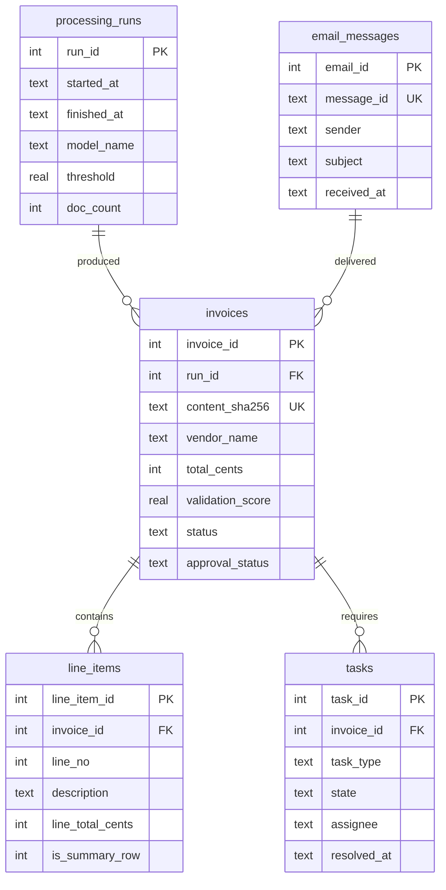

# Database Specification

**Single source of truth for the Phase 4 data layer.**
Supersedes `database-redesign-spec.md` and `database-completion-spec.md`, both of which are folded
into this document. Their earlier versions remain in git history.

**Owner:** Neo. **Branch:** `neo/database-redesign`. **Schema version:** 4.
**Last verified:** 2026-08-28, by 138 automated tests plus an end-to-end pipeline run.

---

## 1. Purpose

The database is the record of what the pipeline extracted, how confident it was, and what a human
decided about it. It has three jobs:

1. **Keep the extracted data queryable.** Not as a blob, as columns and rows.
2. **Refuse to store nonsense.** Constraints, not conventions.
3. **Make re-runs safe.** Processing the same document twice updates one row, it does not create two.

It is deliberately not an accounting system. It stores what a document said, not what the business
owes.

## 2. Scope

**In scope:** the schema, migrations, the write path (`storage.py`), and the read paths
(`query_db.py`, `app.py`).

**Out of scope:** extraction accuracy (JJ's lane), the validation gate's scoring rules (Neo's lane
but specified separately), email intake (Luke's lane), OCR.

---

## 3. Entity model



One run processes many documents. One email can deliver several attachments, so it can produce
several invoices. One invoice contains many line items and can require several tasks over its life.

Deleting an invoice deletes its line items and its tasks (`ON DELETE CASCADE`). Deleting a run is
blocked while invoices reference it. `invoices.email_id` is nullable, because dropping a PDF
straight into `inbox/` is the documented way to test without Gmail.

---

## 4. Data dictionary

`PRAGMA foreign_keys = ON` is set on every connection. SQLite defaults it OFF, and without it the
foreign keys are decorative.

### 4.1 `schema_version`

Records which migrations have been applied. Its absence or a wrong value makes the code refuse to
run, so schema drift between teammates fails loudly instead of silently.

| Field | Type | Null | Meaning |
|---|---|---|---|
| `version` | INTEGER PK | no | The migration number applied. Currently `1`. |
| `applied_at` | TEXT | no | When it was applied. Defaults to `datetime('now')`. |

### 4.2 `processing_runs`

One row per execution of `main.py`. Answers "which model produced this data, at what threshold, and
when". Without it you cannot compare results across runs, which is the whole point of the evaluation
work.

| Field | Type | Null | Meaning and notes |
|---|---|---|---|
| `run_id` | INTEGER PK | no | Autoincrement. |
| `started_at` | TEXT | no | Set when the run opens. |
| `finished_at` | TEXT | **yes** | Set when the run closes cleanly. **NULL means the run crashed.** Nothing currently surfaces this. |
| `model_name` | TEXT | no | e.g. `llama3.2`. The legacy row reads `llama3.2 (legacy, pre-migration)` because the real value was never recorded. |
| `threshold` | REAL | no | The gate threshold in force, `CHECK BETWEEN 0 AND 1`. Stored per run because changing it changes what "Validated" means. |
| `doc_count` | INTEGER | no | Documents stored by this run. Defaults to 0 until the run closes. |

### 4.3 `invoices`

One row per unique document. The central table.

| Field | Type | Null | Meaning and notes |
|---|---|---|---|
| `invoice_id` | INTEGER PK | no | Autoincrement. Stable across re-runs, because re-processing updates rather than inserts. |
| `run_id` | INTEGER FK | no | The **most recent** run that touched this row, not the first. |
| `file_name` | TEXT | no | The file as received. Not unique: the same invoice can arrive under different names. |
| `source_sha256` | TEXT | no | SHA-256 of the raw file bytes. **Provenance only, deliberately not unique.** See §5.1 for why. |
| `content_sha256` | TEXT | no | SHA-256 of the extracted text with whitespace collapsed. **This is the deduplication key.** Falls back to `bytes:<source_sha256>` for a document with no text layer. |
| `invoice_number` | TEXT | yes | As extracted. NULL on all current rows, because the extractor does not return it. |
| `vendor_name` | TEXT | yes | As extracted, or filled by the filename heuristic in `DocumentExtractor`. **A value here does not prove the model found it.** |
| `invoice_date` | TEXT | yes | `YYYY-MM-DD` or NULL, enforced by `CHECK ... GLOB '[0-9][0-9][0-9][0-9]-[0-9][0-9]-[0-9][0-9]'`. Ambiguous formats such as `03/04/2026` are stored as NULL on purpose rather than guessed. The original always survives in `raw_json`. See §5.7 for the constraint bug this replaced. |
| `total_cents` | INTEGER | yes | The payable total **in cents**, `CHECK >= 0`. Integer, not float, so money never touches floating point. Divide by 100 at the display edge only. |
| `currency` | TEXT | yes | A 3-letter code, or the literal `Unknown`. Reads `Unknown` on all current rows. |
| `validation_score` | REAL | no | The gate's score, `CHECK BETWEEN 0 AND 1`. **Not a confidence score.** See §5.4. |
| `status` | TEXT | no | `Validated` / `NeedsReview` / `Failed`. **A judgement about data quality, made by the pipeline.** Never written by a human. |
| `total_source` | TEXT | no | `model` / `fallback` / `manual`. **Describes only `total_cents`, not the whole row.** `fallback` means the total was derived from line items. Renamed from `extraction_source` in migration 002 because the old name implied row-level scope. |
| `approval_status` | TEXT | no | `Pending` / `Approved` / `Rejected`. **A business decision, made by a person.** Never written by the pipeline, and never overwritten by re-processing. Written by the dashboard's Approve and Reject buttons. |
| `reviewed_at` | TEXT | yes | When a person decided. NULL until then. Set alongside `approval_status`. |
| `archive_path` | TEXT | yes | Absolute path to the archived file. Absolute on purpose: relative paths broke when the script ran from another directory. |
| `raw_json` | TEXT | yes | Exactly what the model returned, untouched. The audit trail, and the reason dropping an ambiguous date is safe. |
| `email_id` | INTEGER FK | yes | The email that delivered this document. **NULL means "not known to have arrived by email"**, which is the correct value for a file dropped into `inbox/` by hand. Re-processing never erases it: the upsert uses `COALESCE`, so a manual re-run cannot blank the original provenance. |
| `processed_at` | TEXT | no | When this row was last written. |

**Indexes:** `ux_invoices_content` (UNIQUE on `content_sha256`), plus `status`, `vendor_name`, `run_id`.

### 4.4 `email_messages`

One row per email the intake step fetched. Closes the gap where a stored invoice could not say who
sent it, and gives intake the duplicate protection it lacks (FR-1.3).

| Field | Type | Null | Meaning and notes |
|---|---|---|---|
| `email_id` | INTEGER PK | no | Autoincrement. |
| `message_id` | TEXT | no | The RFC 5322 `Message-ID` header. **UNIQUE, and the reason this table works as a dedup key**: it is globally unique by definition, so "have we fetched this already" is a single lookup. |
| `sender` | TEXT | no | The `From` address. |
| `subject` | TEXT | yes | |
| `received_at` | TEXT | yes | From the `Date` header. No format CHECK, because email date formats vary far more than an invoice date does. |
| `fetched_at` | TEXT | no | When our intake step downloaded it, which is not the same as when it arrived. |
| `attachment_count` | INTEGER | no | How many attachments were saved. `CHECK >= 0`. |

**Not yet written to.** `email_listener.py` is Luke's file and has not been changed. The storage API
(`record_email`, `has_seen_email`) exists and is tested, waiting for intake to call it.

### 4.5 `tasks`

One row per unit of human work a document created. This is what replaces `DownstreamDispatcher`
printing fake Teams and Jira lines that vanished when the terminal closed.

| Field | Type | Null | Meaning and notes |
|---|---|---|---|
| `task_id` | INTEGER PK | no | Autoincrement. |
| `invoice_id` | INTEGER FK | no | `ON DELETE CASCADE`. |
| `task_type` | TEXT | no | `Review` / `Approve` / `Fix`. See §5.9 for the routing rule. |
| `reason` | TEXT | yes | Why the task exists, in words a person can read. |
| `assignee` | TEXT | yes | Unused so far. There is no user table yet. |
| `state` | TEXT | no | `Open` / `InProgress` / `Done` / `Cancelled`. |
| `created_at` | TEXT | no | |
| `resolved_at` | TEXT | yes | **Set exactly when `state` is terminal**, enforced by `CHECK ((state IN ('Done','Cancelled')) = (resolved_at IS NOT NULL))`. Without that check the two drift and "how many are still open" stops being answerable. |
| `external_ref` | TEXT | yes | The Jira key, once a real integration exists. NULL today, deliberately. |

**Index `ux_tasks_one_open`** is a partial unique index on `(invoice_id, task_type)` restricted to
`state IN ('Open','InProgress')`. It is what stops a re-run of the pipeline opening a second
identical task every time it sees the same document, while still allowing a new task after the
previous one is closed.

### 4.6 `line_items`

One row per line on the invoice. This table is what made the trapped totals recoverable.

| Field | Type | Null | Meaning and notes |
|---|---|---|---|
| `line_item_id` | INTEGER PK | no | Autoincrement. |
| `invoice_id` | INTEGER FK | no | `ON DELETE CASCADE`. |
| `line_no` | INTEGER | no | Position on the document, from 1. `UNIQUE (invoice_id, line_no)`. |
| `description` | TEXT | no | The item text. Empty descriptions become `(unnamed item N)` rather than failing the insert. |
| `quantity` | REAL | yes | As extracted. |
| `unit_price_cents` | INTEGER | yes | Cents, `CHECK >= 0`. |
| `line_total_cents` | INTEGER | yes | Cents, `CHECK >= 0`. **Not verified against `quantity * unit_price`.** Nothing flags a mismatch today. |
| `is_summary_row` | INTEGER | no | `0` or `1`. `1` means "this is a total, not a purchase, exclude it from any SUM". See §5.3. |

---

## 5. Design decisions, with the evidence behind them

### 5.1 The deduplication key is extracted text, not file bytes

An earlier draft keyed on `source_sha256`. Measured 2026-08-26, that would have deduplicated
nothing. ReportLab writes a random `/ID` into every PDF it generates:

```
sample_invoice_1_INV-2026-001.pdf   d5c4448f...  vs  a7792035...   DIFFERENT
/ID run a: [<7c50d45da46b4a53b493a0bc9223a879>]
/ID run b: [<ca215dd54ff3413d6f45f7c475381abb>]
same 2454 bytes, same /CreationDate, only /ID differs
```

The extracted text is stable across regeneration:

```
sample_invoice_1  18cc6c06  18cc6c06  18cc6c06   TEXT-STABLE
sample_invoice_2  53b4bd2c  53b4bd2c  53b4bd2c   TEXT-STABLE
sample_invoice_3  58249a70  58249a70  58249a70   TEXT-STABLE
```

Confirmed in practice: four pipeline runs on regenerated mocks, still three rows, with byte hashes
rotating every run and content hashes never moving.

**Known limit.** A text hash needs a text layer. When OCR lands, scanned documents will need the
`bytes:` fallback, and OCR output is not byte-stable, so this decision will have to be revisited.

### 5.2 Money as integer cents

Floats are imprecise. This could not be shown producing a wrong total on the current data, so it is
recorded as a design defect rather than a live bug, but it is removed from the money path anyway.

### 5.3 `is_summary_row` uses exact label matching

On invoice 2 the model emitted `"Grand Total": 2650.00` as a line item. Without flagging it, any
`SUM` double-counts.

The rule normalises the description (lowercase, strip non-alphanumerics) and requires an **exact**
match against a fixed set, plus `quantity <= 1`:

```
"Grand Total"          -> "grandtotal"          FLAG
"Total Station Rental" -> "totalstationrental"  no match
```

A substring rule would wrongly flag the second. Recovery of the grand total uses a narrower set that
excludes `subtotal`, since a subtotal sits before tax.

### 5.4 `validation_score` is not a confidence score

It measures field completeness and substring agreement. It is not a probability and carries no
calibration. The column was renamed from `confidence_score` for exactly this reason. The in-memory
Pydantic field in `main.py` is still called `confidence_score`, because `ProcessedRecord` is a shared
contract and renaming it needs the group's agreement.

### 5.5 Recovery runs on every write, not only in the backfill

The migration recovers totals from line items. Because writes upsert on the content hash, the next
pipeline run would have overwritten every recovered total with the model's `0.00`. The same recovery
therefore runs in the write path, sharing one code path with the backfill.

### 5.6 Approval never touches the pipeline's verdict

`status` and `validation_score` record what the pipeline judged. `approval_status` and
`reviewed_at` record what a person decided. The dashboard writes only the second pair.

A row can therefore read `NeedsReview` and `Approved` at the same time. That is not a
contradiction, it is the useful case: the extractor was not confident, and a reviewer accepted the
document anyway. The dashboard labels the columns **Data Quality** and **Approval** so this reads
correctly. The earlier behaviour overwrote `status` and set `validation_score = 1.0`, which erased
the only evidence that the extractor had struggled.

### 5.7 The `invoice_date` constraint was broken from the start, and tests found it

The original constraint, carried from the first spec through migration 001, was:

```sql
CHECK (invoice_date IS NULL OR invoice_date GLOB '____-__-__')
```

GLOB has no single-character wildcard. `_` is a literal underscore; the `_` wildcard belongs to
`LIKE`, and GLOB uses `?`. So the constraint accepted only the literal string `____-__-__` and
**rejected every real date**:

```
SELECT '2026-08-10' GLOB '____-__-__'   ->  0
SELECT '____-__-__' GLOB '____-__-__'   ->  1
SELECT '2026-08-10' LIKE '____-__-__'   ->  1
```

It never fired, because the extractor returns NULL for every date, so no row has ever carried one.
It would have fired on the first insert after the extraction schema is fixed, which is work already
planned in JJ's lane. The failure would have looked like the extraction fix breaking the database.

Migration 003 replaces it with character classes, which also verify the characters are digits:

```sql
CHECK (invoice_date IS NULL OR
       invoice_date GLOB '[0-9][0-9][0-9][0-9]-[0-9][0-9]-[0-9][0-9]')
```

This is the clearest argument for §8.3 that the project has: the bug was found within minutes of
the test suite existing, by a test that simply saved a normal invoice.

### 5.8 Task type follows what the document needs, not how well it was read

```
NeedsReview -> Review     the pipeline could not read it confidently
Validated   -> Approve    it was read cleanly, but money still needs a human signature
```

A `Validated` document therefore still creates work. That is the honest model of the workflow:
automation reduces the reading, it does not remove the approval. A design that opened tasks only for
low-confidence documents would quietly imply that a confident extraction can pay an invoice by
itself.

A task leaves the queue when a person decides. Approving resolves it as `Done`; rejecting resolves
it as `Cancelled`, because the document was not accepted and nothing downstream should treat it as
processed.

### 5.9 Write, then archive

The database write commits before `shutil.move`. If the move fails, the file stays in `inbox/` and
the next run upserts onto the same row. The old order archived the file first and could leave a file
with no record.

---

## 6. Migration history

| Version | File | What it did | Status |
|---|---|---|---|
| 1 | `migrations/001_normalise.py` | Flat `workflow_records` to `processing_runs` / `invoices` / `line_items`. Recovered three trapped totals. Renamed the old table to `workflow_records_v1` and kept it. | **Applied** |
| 2 | `migrations/002_rename_total_source.py` | Renamed `extraction_source` to `total_source`. | **Applied** |
| 3 | `migrations/003_fix_date_check.py` | Repaired the `invoice_date` CHECK. Table rebuild, since SQLite cannot ALTER a constraint. | **Applied** |
| 4 | `migrations/004_email_and_tasks.py` | Added `email_messages` and `tasks`, and `invoices.email_id`. Purely additive. | **Applied** |

Every migration backs the database up first, refuses to run out of order, is idempotent, and prints
a before/after report that proves no money moved.

Migration 001 freezes the version-1 DDL inline rather than importing `storage.DDL`, because
`storage.DDL` describes the *current* schema and moves on with every migration, while 001 must keep
producing the exact shape that 002 and 003 expect to alter. The helper functions are still imported,
which is a deliberate and different choice: they produce data rather than structure, so a later fix
to the cents conversion should benefit a backfill run today as much as one run last week.

`tests/test_migration.py::TestChain::test_migrated_matches_fresh` asserts that replaying
1 → 2 → 3 produces the same table shapes and indexes as a database created directly from
`storage.DDL`. Without it, teammates who migrated and teammates who started clean could drift apart
silently.

**Migration 001 result, against independently transcribed ground truth:**

| File | before | after | source |
|---|---|---|---|
| INV-2026-001 | 0.00 | 1,500.00 | fallback (sum of 3 line items) |
| INV-2026-003 | 0.00 | 2,350.00 | fallback (sum of 2 line items) |
| INV-2026-002 | 0.00 | 2,650.00 | fallback (summary row) |

---

## 7. What the database does and does not prove

Stated explicitly because it is the easiest claim in this project to overstate.

**It does prove:** stored totals are 3/3 correct against ground truth. Constraints reject every
invalid row we tried. Re-running does not duplicate.

**It does not prove:** that extraction improved. `evaluation/run_eval.py` still reports OVERALL 3/15
(20%), unchanged. The model still returns `0.00` for every total. The database recovered the numbers
from line items the model happened to get right; it did not make the model better. The `fallback`
marker exists so this distinction survives into any report or demo.

**Other honest limits:** n=3, all synthetic invoices, no real documents, no OCR path, no tax or
shipping lines. The line-item sum equals the truth on these mocks only because the mocks have no tax.
On a real invoice, summing line items understates the total.

---

## 8. Remaining work

Everything the previous version of this section listed is now done: `total_source` renamed,
approval wired, tests written, WAL enabled, reprocess tooling added, crashed runs made visible.
What is left:

### 8.1 Line totals are not reconciled (Tier 2)

Nothing checks `line_total_cents` against `quantity * unit_price`, or the sum of line items against
`total_cents`. Now that both live in real columns, a mismatch is exactly the signal that an
extraction went wrong, and it is cheap to surface. Proposed as a view rather than a constraint,
because a legitimate invoice can carry tax and shipping that break the arithmetic.

### 8.2 The document type is not recorded (Tier 2, concept-level)

The schema treats an invoice and a receipt identically, but they have different workflows: an
invoice is unpaid and needs approval, a receipt is already paid and only needs filing. A
`document_type` column is what would let the downstream task depend on what the document *is*,
rather than only on how confidently it was read.

### 8.3 Intake does not call the email API yet

`email_messages` exists, and `record_email` / `has_seen_email` are implemented and tested. But
`email_listener.py` is **Luke's file** and has not been touched: per the ownership rules, changes to
it go via pull request, not a direct commit. Until intake calls the API, every `invoices.email_id`
stays NULL.

The change on Luke's side is small. Before saving attachments:

```python
result = storage.record_email(
    message_id=msg["Message-ID"], sender=msg["From"],
    subject=msg["Subject"], received_at=msg["Date"],
    attachment_count=len(attachments))
if result["already_seen"]:
    continue          # this is the duplicate protection FR-1.3 asks for
```

The pipeline then needs a way to associate a saved file with that `email_id`, which is the one piece
still undesigned. A sidecar file per attachment or a staging table are both plausible; this should be
agreed with Luke rather than decided here.

### 8.4 Tasks have no assignee and no real integration

`tasks.assignee` is never written, because there is no user table and no notion of who is on the
team. `external_ref` is never written either: the Teams and Jira calls are still simulated prints.
Both are placeholders that make the shape right without pretending the integration exists.

### 8.5 Lower severity

- **`.bak` files accumulate** and nothing cleans them up.
- **The line-item and invoice tables have no soft delete.** `reprocess.py --delete` is permanent.

---

## 9. Conventions for anyone extending this

1. **Money is cents everywhere below the display layer.** Convert with `from_cents` at the edge.
2. **Never add a column without a CHECK** if its values come from a fixed set.
3. **Never write a schema change without a migration.** `CREATE TABLE IF NOT EXISTS` does not migrate.
4. **Anything derived rather than extracted must be labelled** so a reader cannot mistake it for a
   model output.
5. **Pipeline columns and human columns stay separate.** `status` belongs to the pipeline,
   `approval_status` belongs to a person.
6. **Test a constraint by inserting a value that should pass**, not only one that should fail. §5.7
   existed because the constraint had only ever been tested with NULL.
