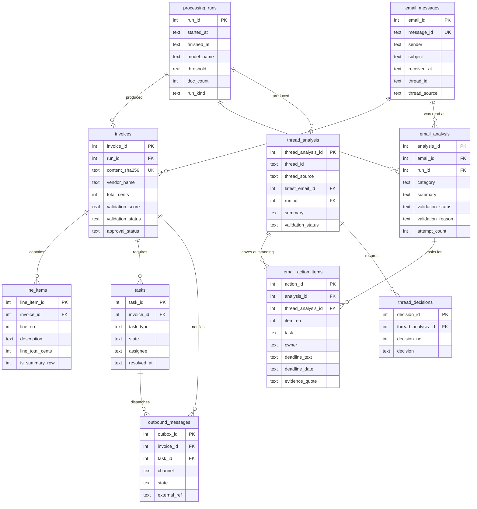

# Database Specification

**Single source of truth for the Phase 4 data layer.**
Supersedes `database-redesign-spec.md` and `database-completion-spec.md`, both of which are folded
into this document. Their earlier versions remain in git history.

**Owner:** Neo. **Branch:** `neo/integrate-team`. **Schema version:** 14.
**Last verified:** 2026-09-17, by `./.venv/bin/python -m pytest tests/ -q` plus an
end-to-end pipeline run. The test count is deliberately not quoted here: it changes on
every push and a number in a document rots where a command does not.

---

## 1. Purpose

The database is the record of what the pipeline extracted, how confident it was, and what a human
decided about it. It has three jobs:

1. **Keep the extracted data queryable.** Not as a blob, as columns and rows.
2. **Refuse to store nonsense.** Constraints, not conventions.
3. **Make re-runs safe.** Processing the same document twice updates one row, it does not create two.

It is deliberately not an accounting system. It stores what a document said, not what the business
owes.

## 2. Scope

**In scope:** the schema, migrations, the write path (`storage.py`), and the read paths
(`query_db.py`, `app.py`).

**Out of scope:** extraction accuracy (JJ's lane), the validation gate's scoring rules (Neo's lane
but specified separately), email intake (Luke's lane), OCR.

---

## 3. Entity model



One run processes many documents. One email can deliver several attachments, so it can produce
several invoices. One invoice contains many line items and can require several tasks over its life.

Deleting an invoice deletes its line items and its tasks (`ON DELETE CASCADE`). Deleting a run is
blocked while invoices reference it. `invoices.email_id` is nullable, because dropping a PDF
straight into `inbox/` is the documented way to test without Gmail.

The four tables at the bottom hold the email AI module's output and were added by migration 011.
They touch the invoice pipeline at exactly one point, `processing_runs`, so the two halves of the
project can be compared per model without being coupled. `email_action_items` has two parents because
`ActionItem` is a single class in `email_ai.py` serving both an email's action items and a thread's
outstanding actions: identical rows, different owner. See §5.13.

---

## 4. Data dictionary

`PRAGMA foreign_keys = ON` is set on every connection. SQLite defaults it OFF, and without it the
foreign keys are decorative.

### 4.1 `schema_version`

Records which migrations have been applied. Its absence or a wrong value makes the code refuse to
run, so schema drift between teammates fails loudly instead of silently.

| Field | Type | Null | Meaning |
|---|---|---|---|
| `version` | INTEGER PK | no | The migration number applied. Currently `1`. |
| `applied_at` | TEXT | no | When it was applied. Defaults to `datetime('now')`. |

### 4.2 `processing_runs`

One row per execution of `main.py`. Answers "which model produced this data, at what threshold, and
when". Without it you cannot compare results across runs, which is the whole point of the evaluation
work.

| Field | Type | Null | Meaning and notes |
|---|---|---|---|
| `run_id` | INTEGER PK | no | Autoincrement. |
| `started_at` | TEXT | no | Set when the run opens. |
| `finished_at` | TEXT | **yes** | Set when the run closes cleanly. **NULL means the run crashed.** Nothing currently surfaces this. |
| `model_name` | TEXT | no | e.g. `llama3.2`. The legacy row reads `llama3.2 (legacy, pre-migration)` because the real value was never recorded. |
| `threshold` | REAL | **yes** | The gate threshold in force, `CHECK NULL OR BETWEEN 0 AND 1`. Stored per run because changing it changes what "Validated" means. **Nullable since migration 010**: a run of the email AI has no threshold, and a meaningless `0.0` would be a number in a column where it means nothing. |
| `doc_count` | INTEGER | no | Documents stored by this run. Defaults to 0 until the run closes. |
| `run_kind` | TEXT | no | `invoice` or `email`. Added by migration 010. Without it `SELECT AVG(threshold)` silently mixes two pipelines. |

A table-level `CHECK ((run_kind = 'invoice') = (threshold IS NOT NULL))` ties the two together,
so `threshold` is never NULL for a reason nobody recorded. Same pattern as
`outbound_messages.sent_at` and `tasks.resolved_at`.

### 4.3 `invoices`

One row per unique document. The central table.

| Field | Type | Null | Meaning and notes |
|---|---|---|---|
| `invoice_id` | INTEGER PK | no | Autoincrement. Stable across re-runs, because re-processing updates rather than inserts. |
| `run_id` | INTEGER FK | no | The **most recent** run that touched this row, not the first. |
| `file_name` | TEXT | no | The file as received. Not unique: the same invoice can arrive under different names. |
| `source_sha256` | TEXT | no | SHA-256 of the raw file bytes. **Provenance only, deliberately not unique.** See §5.1 for why. |
| `content_sha256` | TEXT | no | SHA-256 of the extracted text with whitespace collapsed. **This is the deduplication key.** Falls back to `bytes:<source_sha256>` for a document with no text layer. |
| `invoice_number` | TEXT | yes | As extracted. NULL on all current rows, because the extractor does not return it. |
| `vendor_name` | TEXT | yes | As extracted, or filled by the filename heuristic in `DocumentExtractor`. **A value here does not prove the model found it.** |
| `invoice_date` | TEXT | yes | `YYYY-MM-DD` or NULL, enforced by `CHECK ... GLOB '[0-9][0-9][0-9][0-9]-[0-9][0-9]-[0-9][0-9]'`. Ambiguous formats such as `03/04/2026` are stored as NULL on purpose rather than guessed. The original always survives in `raw_json`. See §5.7 for the constraint bug this replaced. |
| `total_cents` | INTEGER | yes | The payable total **in cents**, `CHECK >= 0`. Integer, not float, so money never touches floating point. Divide by 100 at the display edge only. |
| `currency` | TEXT | yes | A 3-letter code, or the literal `Unknown`. Reads `Unknown` on all current rows. |
| `validation_score` | REAL | no | The gate's score, `CHECK BETWEEN 0 AND 1`. **Not a confidence score.** See §5.4. |
| `validation_status` | TEXT | no | `Validated` / `NeedsReview` / `Failed`. The gate's verdict, obtained by thresholding `validation_score`. **Written by `ConfidenceValidator`, never by the model and never by a person.** Called `status` before migration 005. See §5.9. |
| `total_source` | TEXT | no | `model` / `fallback` / `manual`. **Describes only `total_cents`, not the whole row.** `fallback` means the total was derived from line items. Renamed from `extraction_source` in migration 002 because the old name implied row-level scope. |
| `vendor_source` | TEXT | no | The same three values, for `vendor_name`. **Reads `model` on every row today and will until the extractor reports which path it took.** `DocumentExtractor` can silently substitute a filename guess and storage cannot see that it happened. Added during migration 006 because it was free there. |
| `document_type` | TEXT | no | `Invoice` / `Receipt` / `Unknown`. An invoice is unpaid and needs approval; a receipt is already paid and needs filing. **The work that follows approval depends on this**, not on how confidently the document was read. Set by a keyword heuristic over the opening lines; `Unknown` when the document does not say clearly. A human correction survives reprocessing: the upsert only overwrites `Unknown`. |
| `reconciliation` | TEXT | no | `exact` / `plausible` / `short` / `unknown`. `total_cents` against the sum of non-summary line items. **A flag, not a constraint.** See §5.10. |
| `approval_status` | TEXT | no | `Pending` / `Approved` / `Rejected`. **A business decision, made by a person.** Never written by the pipeline, and never overwritten by re-processing. Written by the dashboard's Approve and Reject buttons. |
| `reviewed_at` | TEXT | yes | When a person decided. NULL until then. Set alongside `approval_status`. |
| `archive_path` | TEXT | yes | Absolute path to the archived file. Absolute on purpose: relative paths broke when the script ran from another directory. |
| `raw_json` | TEXT | yes | Exactly what the model returned, untouched. The audit trail, and the reason dropping an ambiguous date is safe. |
| `email_id` | INTEGER FK | yes | The email that delivered this document. **NULL means "not known to have arrived by email"**, which is the correct value for a file dropped into `inbox/` by hand. Re-processing never erases it: the upsert uses `COALESCE`, so a manual re-run cannot blank the original provenance. |
| `processed_at` | TEXT | no | When this row was last written. |

**Indexes:** `ux_invoices_content` (UNIQUE on `content_sha256`), plus `status`, `vendor_name`, `run_id`.

### 4.4 `email_messages`

One row per email the intake step fetched. Closes the gap where a stored invoice could not say who
sent it, and gives intake the duplicate protection it lacks (FR-1.3).

| Field | Type | Null | Meaning and notes |
|---|---|---|---|
| `email_id` | INTEGER PK | no | Autoincrement. |
| `message_id` | TEXT | no | The RFC 5322 `Message-ID` header. **UNIQUE, and the reason this table works as a dedup key**: it is globally unique by definition, so "have we fetched this already" is a single lookup. |
| `sender` | TEXT | no | The `From` address. |
| `subject` | TEXT | yes | |
| `received_at` | TEXT | yes | From the `Date` header. No format CHECK, because email date formats vary far more than an invoice date does. |
| `fetched_at` | TEXT | no | When our intake step downloaded it, which is not the same as when it arrived. |
| `attachment_count` | INTEGER | no | How many attachments were saved. `CHECK >= 0`. |
| `body_text` | TEXT | yes | The message body, for retrieval. Added by migration 008. |
| `body_source` | TEXT | yes | `intake` or `mock`. A retrieval result measured over generated text must never be reported as though it came from real correspondence. |
| `attachment_names` | TEXT | yes | Comma separated, so a PDF in `inbox/` can be traced back to the message that delivered it. Added by migration 009. |
| `thread_id` | TEXT | yes | Thread identity, added by migration 010 so `thread_analysis` has something to join to. |
| `thread_source` | TEXT | yes | `headers`, `subject` or `manual`. See §5.14. |

**Not yet written to by intake.** `email_listener.py` is Luke's file and has not been changed. The
storage API (`record_email`, `has_seen_email`) exists and is tested, and `seed_mock_emails.py`
populates the mock mailbox, but nothing real writes here yet. `thread_id` and `thread_source` are
NULL on every row until either intake captures `In-Reply-To` and `References` or something
groups by subject.

### 4.5 `tasks`

One row per unit of human work a document created. This is what replaces `DownstreamDispatcher`
printing fake Teams and Jira lines that vanished when the terminal closed.

| Field | Type | Null | Meaning and notes |
|---|---|---|---|
| `task_id` | INTEGER PK | no | Autoincrement. |
| `invoice_id` | INTEGER FK | no | `ON DELETE CASCADE`. |
| `task_type` | TEXT | no | `Review` / `Approve` / `Fix`. See §5.9 for the routing rule. |
| `reason` | TEXT | yes | Why the task exists, in words a person can read. |
| `assignee` | TEXT | yes | Unused so far. There is no user table yet. |
| `state` | TEXT | no | `Open` / `InProgress` / `Done` / `Cancelled`. |
| `created_at` | TEXT | no | |
| `resolved_at` | TEXT | yes | **Set exactly when `state` is terminal**, enforced by `CHECK ((state IN ('Done','Cancelled')) = (resolved_at IS NOT NULL))`. Without that check the two drift and "how many are still open" stops being answerable. |
| `external_ref` | TEXT | yes | The Jira key, once a real integration exists. NULL today, deliberately. |

**Index `ux_tasks_one_open`** is a partial unique index on `(invoice_id, task_type)` restricted to
`state IN ('Open','InProgress')`. It is what stops a re-run of the pipeline opening a second
identical task every time it sees the same document, while still allowing a new task after the
previous one is closed.

### 4.6 `line_items`

One row per line on the invoice. This table is what made the trapped totals recoverable.

| Field | Type | Null | Meaning and notes |
|---|---|---|---|
| `line_item_id` | INTEGER PK | no | Autoincrement. |
| `invoice_id` | INTEGER FK | no | `ON DELETE CASCADE`. |
| `line_no` | INTEGER | no | Position on the document, from 1. `UNIQUE (invoice_id, line_no)`. |
| `description` | TEXT | no | The item text. Empty descriptions become `(unnamed item N)` rather than failing the insert. |
| `quantity` | REAL | yes | As extracted. |
| `unit_price_cents` | INTEGER | yes | Cents, `CHECK >= 0`. |
| `line_total_cents` | INTEGER | yes | Cents, `CHECK >= 0`. **Not verified against `quantity * unit_price`.** Nothing flags a mismatch today. |
| `is_summary_row` | INTEGER | no | `0` or `1`. `1` means "this is a total, not a purchase, exclude it from any SUM". See §5.3. |

### 4.7 `email_analysis`

One row per email per run of the AI module. Holds what `EmailAnalysisRecord` carries.

| Field | Type | Null | Meaning and notes |
|---|---|---|---|
| `analysis_id` | INTEGER PK | no | Autoincrement. |
| `email_id` | INTEGER FK | no | `ON DELETE CASCADE`. Resolved by storage from the `message_id` JJ's module sends, the way `email_for_attachment` resolves a file name. |
| `run_id` | INTEGER FK | no | Which run produced it. `UNIQUE (email_id, run_id)`, so a re-run upserts and two models over the same mailbox are two rows. |
| `category` | TEXT | no | One of six, `CHECK`ed. The list is a `Literal` on `EmailAnalysis` in `email_ai.py` and the two must agree. |
| `summary` | TEXT | yes | One or two sentences. |
| `validation_status` | TEXT | no | `Validated`, `NeedsReview` or `Failed`. The module only emits the first two. See §5.15. |
| `validation_reason` | TEXT | yes | A machine-readable code, not a sentence. `CHECK` rejects spaces. Two exist today: `empty_evidence_quote`, `evidence_quote_not_found`. |
| `attempt_count` | INTEGER | no | How many evidence-validation attempts it took. `CHECK >= 1` only, deliberately. See §5.15. |
| `processed_at` | TEXT | no | From the record, falling back to now. |

A table-level `CHECK ((validation_status = 'Validated') = (validation_reason IS NULL))` means a
result held back for a person always says why, which is what makes the failures countable.

### 4.8 `thread_analysis`

One row per thread per run. Holds what `ThreadAnalysisRecord` carries.

| Field | Type | Null | Meaning and notes |
|---|---|---|---|
| `thread_analysis_id` | INTEGER PK | no | Autoincrement. |
| `thread_id` | TEXT | no | `UNIQUE (thread_id, run_id)`. Not a foreign key: see §5.14. |
| `thread_source` | TEXT | no | How the grouping was formed. `headers`, `subject` or `manual`. |
| `latest_email_id` | INTEGER FK | **yes** | The most recent message, where it is in the mailbox. Nullable because `latest_message_id` is `str \| None` on his record, and a thread analysed from text that was never fetched has nothing to point at. |
| `run_id` | INTEGER FK | no | |
| `summary` | TEXT | yes | |
| `validation_status` / `validation_reason` / `attempt_count` / `processed_at` | | | As §4.7. |

### 4.9 `email_action_items`

One row per action the model found, under either parent. Same four fields either way, because
`ActionItem` is one class in `email_ai.py`.

| Field | Type | Null | Meaning and notes |
|---|---|---|---|
| `action_id` | INTEGER PK | no | Autoincrement. |
| `analysis_id` | INTEGER FK | yes | Set for an email's action items. `ON DELETE CASCADE`. |
| `thread_analysis_id` | INTEGER FK | yes | Set for a thread's outstanding actions. `ON DELETE CASCADE`. |
| `item_no` | INTEGER | no | Position in the list, from 1. Unique per parent via two partial indexes. |
| `task` | TEXT | no | What must be done. |
| `owner` | TEXT | yes | The assigned person, NULL where none was named. His module already normalises `"unknown"` and `"none"` to NULL. |
| `deadline_text` | TEXT | yes | The wording exactly as the source put it. The module copies it and does not convert. |
| `deadline_date` | TEXT | yes | ISO, and only where the wording is unambiguous. See §5.16. |
| `evidence_quote` | TEXT | no | The sentence the item was inferred from. This is the field that makes a wrong action item diagnosable rather than merely wrong, the same job `total_source` does. |

`CHECK ((analysis_id IS NULL) <> (thread_analysis_id IS NULL))` enforces exactly one parent.
`CHECK (deadline_date IS NULL OR deadline_text IS NOT NULL)` stops a normalised date existing with
no wording behind it.

**No `state` column, on purpose.** A re-run deletes the children and re-inserts them, the way
`save_invoice` handles `line_items`, so a state would reset a person's finished work to `Open` every
time a model was re-run. This table records what the model said. Lifecycle belongs with `tasks`.

### 4.10 `thread_decisions`

| Field | Type | Null | Meaning and notes |
|---|---|---|---|
| `decision_id` | INTEGER PK | no | Autoincrement. |
| `thread_analysis_id` | INTEGER FK | no | `ON DELETE CASCADE`. |
| `decision_no` | INTEGER | no | Position in the list, from 1. `UNIQUE (thread_analysis_id, decision_no)`. |
| `decision` | TEXT | no | One decision. |

`latest_decisions` is `list[str]`, so it is rows rather than a joined string. The ordinal exists
because a list is ordered and a set of rows is not. Storing a list as a delimited blob was the
`line_items` mistake and it cost a migration to undo.

---

---

## 5. Design decisions, with the evidence behind them

### 5.1 The deduplication key is extracted text, not file bytes

An earlier draft keyed on `source_sha256`. Measured 2026-08-26, that would have deduplicated
nothing. ReportLab writes a random `/ID` into every PDF it generates:

```
sample_invoice_1_INV-2026-001.pdf   d5c4448f...  vs  a7792035...   DIFFERENT
/ID run a: [<7c50d45da46b4a53b493a0bc9223a879>]
/ID run b: [<ca215dd54ff3413d6f45f7c475381abb>]
same 2454 bytes, same /CreationDate, only /ID differs
```

The extracted text is stable across regeneration:

```
sample_invoice_1  18cc6c06  18cc6c06  18cc6c06   TEXT-STABLE
sample_invoice_2  53b4bd2c  53b4bd2c  53b4bd2c   TEXT-STABLE
sample_invoice_3  58249a70  58249a70  58249a70   TEXT-STABLE
```

Confirmed in practice: four pipeline runs on regenerated mocks, still three rows, with byte hashes
rotating every run and content hashes never moving.

**Known limit.** A text hash needs a text layer. When OCR lands, scanned documents will need the
`bytes:` fallback, and OCR output is not byte-stable, so this decision will have to be revisited.

### 5.2 Money as integer cents

Floats are imprecise. This could not be shown producing a wrong total on the current data, so it is
recorded as a design defect rather than a live bug, but it is removed from the money path anyway.

### 5.3 `is_summary_row` uses exact label matching

On invoice 2 the model emitted `"Grand Total": 2650.00` as a line item. Without flagging it, any
`SUM` double-counts.

The rule normalises the description (lowercase, strip non-alphanumerics) and requires an **exact**
match against a fixed set, plus `quantity <= 1`:

```
"Grand Total"          -> "grandtotal"          FLAG
"Total Station Rental" -> "totalstationrental"  no match
```

A substring rule would wrongly flag the second. Recovery of the grand total uses a narrower set that
excludes `subtotal`, since a subtotal sits before tax.

### 5.4 `validation_score` is not a confidence score

It measures field completeness and substring agreement. It is not a probability and carries no
calibration. The column was renamed from `confidence_score` for exactly this reason. The in-memory
Pydantic field in `main.py` is still called `confidence_score`, because `ProcessedRecord` is a shared
contract and renaming it needs the group's agreement.

### 5.5 Recovery runs on every write, not only in the backfill

The migration recovers totals from line items. Because writes upsert on the content hash, the next
pipeline run would have overwritten every recovered total with the model's `0.00`. The same recovery
therefore runs in the write path, sharing one code path with the backfill.

### 5.6 Approval never touches the pipeline's verdict

`status` and `validation_score` record what the pipeline judged. `approval_status` and
`reviewed_at` record what a person decided. The dashboard writes only the second pair.

A row can therefore read `NeedsReview` and `Approved` at the same time. That is not a
contradiction, it is the useful case: the extractor was not confident, and a reviewer accepted the
document anyway. The dashboard labels the columns **Data Quality** and **Approval** so this reads
correctly. The earlier behaviour overwrote `status` and set `validation_score = 1.0`, which erased
the only evidence that the extractor had struggled.

### 5.7 The `invoice_date` constraint was broken from the start, and tests found it

The original constraint, carried from the first spec through migration 001, was:

```sql
CHECK (invoice_date IS NULL OR invoice_date GLOB '____-__-__')
```

GLOB has no single-character wildcard. `_` is a literal underscore; the `_` wildcard belongs to
`LIKE`, and GLOB uses `?`. So the constraint accepted only the literal string `____-__-__` and
**rejected every real date**:

```
SELECT '2026-08-10' GLOB '____-__-__'   ->  0
SELECT '____-__-__' GLOB '____-__-__'   ->  1
SELECT '2026-08-10' LIKE '____-__-__'   ->  1
```

It never fired, because the extractor returns NULL for every date, so no row has ever carried one.
It would have fired on the first insert after the extraction schema is fixed, which is work already
planned in JJ's lane. The failure would have looked like the extraction fix breaking the database.

Migration 003 replaces it with character classes, which also verify the characters are digits:

```sql
CHECK (invoice_date IS NULL OR
       invoice_date GLOB '[0-9][0-9][0-9][0-9]-[0-9][0-9]-[0-9][0-9]')
```

This is the clearest argument for §8.3 that the project has: the bug was found within minutes of
the test suite existing, by a test that simply saved a normal invoice.

### 5.8 Task type follows what the document needs, not how well it was read

```
NeedsReview -> Review     the pipeline could not read it confidently
Validated   -> Approve    it was read cleanly, but money still needs a human signature
```

A `Validated` document therefore still creates work. That is the honest model of the workflow:
automation reduces the reading, it does not remove the approval. A design that opened tasks only for
low-confidence documents would quietly imply that a confident extraction can pay an invoice by
itself.

A task leaves the queue when a person decides. Approving resolves it as `Done`; rejecting resolves
it as `Cancelled`, because the document was not accepted and nothing downstream should treat it as
processed.

### 5.9 The column is named for who writes it, not for what it is about

`status` was renamed to `validation_status` in migration 005. The old name said nothing
about whose judgement it holds, which stopped being acceptable once `approval_status` sat
next to it: a reader seeing `NeedsReview` and `Approved` together had no way to tell the two
are independent.

`model_result_status` was proposed and rejected. The value does not come from the model. It
is computed in `ConfidenceValidator`:

```python
status = "Validated" if final_score >= self.threshold else "NeedsReview"
```

which thresholds a score this project's own gate calculates from field completeness and
substring matching. Lower the threshold to 0.30 tomorrow and every value in the column
changes while the model does identical work. Naming it after the model would have written
a false causal story into the schema, in the exact direction this project keeps having to
correct: attributing to model accuracy what is actually our own code's behaviour.

`validation_status` shares a stem with `validation_score`, so the pair reads as one thing:
the gate produced a score, and a verdict derived from that score.

### 5.10 Reconciliation is a flag, not a constraint

The invoice total is held twice, read two different ways: once from a total line, once as the sum
of the line items. Nothing compared them until migration 006.

```
exact      they agree
plausible  the total is higher, which tax or shipping would explain
short      the total is lower, which neither can explain
unknown    there are no line items to compare against
```

Measured 2026-08-30, this catches a failure that proximity checking cannot. Required extraction
fields make the model invent a total on a document that states none: given a statement of account
reading `Opening balance 1,200.00 / Payments received 800.00`, it returned `2000.0`. It did not copy
a wrong number, it **computed** a plausible one, and a proximity check passes anything the model can
point at on the page. Arithmetic does not.

It is a flag because `plausible` is the normal state of any real invoice carrying GST or freight.
Only `short` is an anomaly on its own, because neither can reduce a total.

Computed on write and stored, rather than derived on read, so the dashboard and any report query see
the same value and a later change to the rule cannot silently rewrite history.

### 5.11 Approval hands off; it does not terminate

Approving used to close the open task and stop. Since migration 007 it opens the work that comes
next, chosen by what the document **is**:

```
Invoice approved  -> Payment task    the money still has to move
Receipt approved  -> File task       nothing to pay
Unknown approved  -> Review task     routed to a person, not on a guess
Rejected          -> nothing         the document was not accepted
```

This is what `document_type` is for. Without it the follow-on work could only depend on
`validation_status`, which answers "was it read clearly", not "what needs to happen now".

`outbound_messages` records each dispatch. **Nothing is sent.** Rows are written `Pending` and no
code path in this project sets `Sent`; the `CHECK` requires `sent_at` alongside it. That is the
honest state of the work rather than an oversight, and a queue holding pending notifications
demonstrates the workflow where a `print` that has already scrolled past demonstrates nothing.

### 5.12 Write, then archive

The database write commits before `shutil.move`. If the move fails, the file stays in `inbox/` and
the next run upserts onto the same row. The old order archived the file first and could leave a file
with no record.

### 5.13 One `email_action_items` table with two parents, not two tables

**On the name.** This table was called `action_items` until 19 September 2026, when a parallel
branch turned out to have created a table of the same name holding the actions found inside an
invoice document. Same name, different parent, different columns. Both were renamed for what
they hang off, `email_action_items` and `invoice_action_items`, while neither had reached `main`
and the change was still a text edit rather than a migration.

`ActionItem` is a single Pydantic class in `email_ai.py` serving both `EmailAnalysis.action_items`
and `ThreadSummary.outstanding_actions`. Same four fields, different owner.

Two tables would mean every future change to that class costs two migrations, and "which actions
does Neo owe" needs a UNION. One table with two nullable parent keys and an exactly-one CHECK costs
one nullable column that is always exactly half set.

**This looks like the nullable foreign key rejected for `tasks`, and the difference matters.** That
rejection was about merging two things that need *different* columns, which produces rows half full
of NULLs, which is the flat `workflow_records` shape Phase 4 undid. Here the row shape is identical
and only the parent differs. Merging identical rows is normalisation; merging different rows is the
flat table.

### 5.14 `thread_id` is a string, not a foreign key, and it records how it was guessed

`email_messages` has no `In-Reply-To` and no `References`, and `email_listener.py` does not read
them. So there is no reply chain to point at, and `thread_analysis.thread_id` is a bare string.

Two ways to produce one. **From headers** is correct and is what mail clients use; it needs intake
to capture them, which is Luke's file. **From the subject** needs nobody and is wrong often enough
to matter: two unrelated "Monthly statement" emails from different vendors become one thread, and a
subject someone edited mid-conversation splits one thread into two.

`thread_source` records which was used, for the same reason `body_source` and `total_source` exist.
**Until intake changes, every row says `subject`, and every claim about threads in the report has
to say so.** A summary computed over a guessed grouping must never be reported as though it came
from a real chain.

### 5.15 Three constraints are looser than they could be

**`attempt_count >= 1`, not `BETWEEN 1 AND 3`.** The cap already exists in `email_ai.py` as
`le=MAX_EVIDENCE_ATTEMPTS`, in four places. Copying it here means the day that constant is raised,
every insert fails and the fix is a migration. `invoice_date` carries the scar of a constraint
written tighter than the data (§5.7). One cap, where the retry loop is.

**`validation_reason` is not a value list.** Two codes exist today and a third appears the first
time the validator learns a new failure. The CHECK only enforces that it is a code and not a
sentence, by rejecting spaces, which is enough to keep `GROUP BY validation_reason` countable. That
countability is the whole reason the column is separate from the status.

**`validation_status` allows `Failed`, which the module cannot produce.** It emits only `Validated`
and `NeedsReview`, and that is correct: the point of the retry change is that a failed analysis is
*retained* for measurement, and a retained result is `NeedsReview`. `Failed` would mean no analysis
exists, which is not a row. The column matches `invoices` so the vocabulary is one thing across the
schema, and storage never writes it.

**`category` is constrained, though.** It is model output rather than code output, and an LLM
drifts to "Project Update" or "Meeting request" given the chance. A free-text category cannot be
aggregated across runs. A seventh label is a one-line migration, and it should be one, because the
list is a shared contract with `email_ai.py`.

### 5.16 A deadline needs two columns

The module sends the original wording and does not convert it. `deadline_date` is populated only
where the wording is unambiguous, which is narrower than it sounds:

| Wording | `deadline_date` | Why |
|---|---|---|
| `2026-09-30` | `2026-09-30` | Already ISO, returned untouched |
| `by 30 September 2026` | `2026-09-30` | Month named, no ordering ambiguity |
| `30/09/2026` | **NULL** | Day-month order is not knowable. AU and US disagree |
| `by Friday` | **NULL** | Needs an anchor date and a timezone |
| `end of month` | **NULL** | Not a date |

**The ISO passthrough is a bug fix written before the bug.**
`dateutil.parser.parse('2026-03-12', dayfirst=True)` returns **3 December**, because `dayfirst` is
applied to the last two components whatever the shape of the string. Found on 2026-09-12 in the
error taxonomy work. `coerce_deadline_date` delegates to `coerce_date`, which matches explicit
formats and never guesses, and a test fails if an already-ISO value is ever re-parsed.

**A model asked for a nullable string sometimes answers with the word.** On 2026-09-17
`llama3.2` returned `deadline_text` as the four-character string `"null"` on a real message
from the mock mailbox. `email_ai.normalise_owner` already maps that to None, but only for
`owner`, so it reached storage intact. `'null'` is not NULL, so every count of "action items
carrying a deadline" would have been wrong, including the one below. `storage.absent_string`
now maps exactly the four values his validator maps, repeated rather than extended so the two
cannot disagree, and a test fails if he widens his set without this following. **Found by
running the real model, not by reading the code.**

**What stays NULL is worth reporting.** The share of action items where `deadline_text IS NOT NULL
AND deadline_date IS NULL` says how often the model found a deadline no system can act on.
`save_email_analysis` returns that count rather than leaving it to be worked out later. That is a
better report line than a normaliser that guesses and is usually right.

---

## 6. Migration history

| Version | File | What it did | Status |
|---|---|---|---|
| 1 | `migrations/001_normalise.py` | Flat `workflow_records` to `processing_runs` / `invoices` / `line_items`. Recovered three trapped totals. Renamed the old table to `workflow_records_v1` and kept it. | **Applied** |
| 2 | `migrations/002_rename_total_source.py` | Renamed `extraction_source` to `total_source`. | **Applied** |
| 3 | `migrations/003_fix_date_check.py` | Repaired the `invoice_date` CHECK. Table rebuild, since SQLite cannot ALTER a constraint. | **Applied** |
| 4 | `migrations/004_email_and_tasks.py` | Added `email_messages` and `tasks`, and `invoices.email_id`. Purely additive. | **Applied** |
| 5 | `migrations/005_rename_validation_status.py` | Renamed `status` to `validation_status`. | **Applied** |
| 6 | `migrations/006_storage_completion.py` | Added `reconciliation`, `vendor_source`, `document_type`, and backfilled the first two from stored data. Additive. | **Applied** |
| 7 | `migrations/007_post_approval.py` | Extended `task_type` with `Payment` and `File`; added `outbound_messages`. | **Applied** |
| 8 | `migrations/008_email_body.py` | Added `email_messages.body_text` and `body_source`, for retrieval. Additive. | **Applied** |
| 9 | `migrations/009_attachment_names.py` | Added `email_messages.attachment_names`, so a file in `inbox/` can be traced to its message. Additive. | **Applied** |
| 10 | `migrations/010_run_kind_and_threads.py` | Rebuilt `processing_runs` for a nullable `threshold` and a `run_kind`; added `thread_id` and `thread_source` to `email_messages`. | **Applied** |
| 11 | `migrations/011_email_analysis.py` | Added `email_analysis`, `thread_analysis`, `email_action_items`, `thread_decisions`. Additive. | **Applied** |
| 12 | `migrations/012_invoice_ai_fields.py` | Added `email_attachments` and `invoice_action_items`, and `invoices.category` / `invoices.summary`. Luke's SQL, re-landed at a free number. Additive. | **Applied** |
| 13 | `migrations/013_reviewer_login.py` | Added `users` and `invoices.reviewed_by`. Written on `luke/team-tasks` as 010 and re-landed here because 010 was already taken. Additive. | **Applied** |
| 14 | `migrations/014_must_change_password.py` | Added `users.must_change_password`. Written as 011 and re-landed for the same reason. Additive. | **Applied** |

Every migration backs the database up first, refuses to run out of order, is idempotent, and prints
a before/after report that proves no money moved.

**Never renumber a migration that is already on `main`.** Migration 012 carries SQL Luke
wrote as 008 and 009, numbers that were already taken and already applied to every
teammate's database. A renumbered migration expects a version that no longer exists,
refuses, and the chain stops there. The SQL was never the problem.

**010 and 011 name their backups differently, and 001 to 009 should follow.** The others stamp the
file with `%Y%m%d-%H%M%S`. Run two migrations back to back, which is exactly what the quickstart
does, and both land in the same second: the second copy overwrites the first, leaving no way back
to the state before the pair. 010 and 011 add a counter when the name is taken. This was found by
running them, not by reading them.

**011 takes its SQL out of `storage.DDL` rather than restating it.** It slices the four tables from
the one definition, so a fresh database and a migrated one cannot disagree about them. That is the
opposite of migration 001's choice below, and for a reason: 001 must keep producing the *version 1*
shape that 002 and 003 expect to alter, while 011 adds tables nothing later has altered yet. The
day something alters them, 011 must freeze its copy like 001 did.

Migration 001 freezes the version-1 DDL inline rather than importing `storage.DDL`, because
`storage.DDL` describes the *current* schema and moves on with every migration, while 001 must keep
producing the exact shape that 002 and 003 expect to alter. The helper functions are still imported,
which is a deliberate and different choice: they produce data rather than structure, so a later fix
to the cents conversion should benefit a backfill run today as much as one run last week.

`tests/test_migration.py::TestChain::test_migrated_matches_fresh` asserts that replaying the
whole chain produces the same table shapes and indexes as a database created directly from
`storage.DDL`. Without it, teammates who migrated and teammates who started clean could drift apart
silently.

**Migration 001 result, against independently transcribed ground truth:**

| File | before | after | source |
|---|---|---|---|
| INV-2026-001 | 0.00 | 1,500.00 | fallback (sum of 3 line items) |
| INV-2026-003 | 0.00 | 2,350.00 | fallback (sum of 2 line items) |
| INV-2026-002 | 0.00 | 2,650.00 | fallback (summary row) |

---

## 7. What the database does and does not prove

Stated explicitly because it is the easiest claim in this project to overstate.

**It does prove:** stored totals are 3/3 correct against ground truth. Constraints reject every
invalid row we tried. Re-running does not duplicate.

**It does not prove:** that extraction improved. `evaluation/run_eval.py` still reports OVERALL 3/15
(20%), unchanged. The model still returns `0.00` for every total. The database recovered the numbers
from line items the model happened to get right; it did not make the model better. The `fallback`
marker exists so this distinction survives into any report or demo.

**Other honest limits:** n=3, all synthetic invoices, no real documents, no OCR path, no tax or
shipping lines. The line-item sum equals the truth on these mocks only because the mocks have no tax.
On a real invoice, summing line items understates the total.

---

## 8. Remaining work

Everything the previous version of this section listed is now done: `total_source` renamed,
approval wired, tests written, WAL enabled, reprocess tooling added, crashed runs made visible.
What is left:

### 8.1 The heuristics are tuned on three synthetic documents

Two rules were fitted to output from one generator, and both will need revisiting against real
documents:

- `ConfidenceValidator.LABEL_WINDOW = 2`, because ReportLab happens to put a total one line below
  its label. An invoice that puts the amount in a table cell would score `present` rather than
  `verified` and go to a person. That fails in the safe direction, but it fails.
- `classify_document` reads the opening lines for `TAX INVOICE`-style markers. It has never been
  tested against a real receipt, because the project has none.

Deliberately not hardened further until there are documents worth hardening against. Fitting more
rules to three files we generated ourselves would produce work that has to be thrown away.

### 8.2 Intake does not call the email API yet

`email_messages` exists, and `record_email` / `has_seen_email` are implemented and tested. But
`email_listener.py` is **Luke's file** and has not been touched: per the ownership rules, changes to
it go via pull request, not a direct commit. Until intake calls the API, every `invoices.email_id`
stays NULL.

The change on Luke's side is small. Before saving attachments:

```python
result = storage.record_email(
    message_id=msg["Message-ID"], sender=msg["From"],
    subject=msg["Subject"], received_at=msg["Date"],
    attachment_count=len(attachments))
if result["already_seen"]:
    continue          # this is the duplicate protection FR-1.3 asks for
```

The pipeline then needs a way to associate a saved file with that `email_id`, which is the one piece
still undesigned. A sidecar file per attachment or a staging table are both plausible; this should be
agreed with Luke rather than decided here.

### 8.3 Tasks have no assignee and no real integration

`tasks.assignee` is never written, because there is no user table and no notion of who is on the
team. `external_ref` is never written either: the Teams and Jira calls are still simulated prints.
Both are placeholders that make the shape right without pretending the integration exists.

### 8.4 An email action item cannot queue a notification

`outbound_messages.invoice_id` is `NOT NULL`, so the outbox only accepts invoice work. An action
item the model found in an email has nowhere to go.

The outbox is the right place for it: notification should have one path, not two, and the argument
for separate `tasks` and `email_action_items` tables was never an argument for separate queues. Doing it
needs `invoice_id` nullable with an exactly-one CHECK, which is another migration, and first a
decision about whether email actions notify anyone at all. **Recorded here so it is not
rediscovered later.**

### 8.5 The analysis tables are empty

Migration 011 created them and nothing writes to them yet. `save_email_analysis` and
`save_thread_analysis` are implemented and tested, including against real `EmailAnalysisRecord`
objects, but the module that produces those records is not yet wired to call them. That is the
handoff to JJ, not a gap in the schema.

There is also no ground truth for summarisation, classification or action extraction, so nothing
here can yet be scored the way `evaluation/` scores extraction. Storing the output is the
prerequisite for that, not a substitute for it.

### 8.6 Lower severity

- **`.bak` files accumulate** and nothing cleans them up.
- **The line-item and invoice tables have no soft delete.** `reprocess.py --delete` is permanent.
- **Migrations 001 to 009 can overwrite each other's backups** when run in the same second. See §6.

---

## 9. Conventions for anyone extending this

1. **Money is cents everywhere below the display layer.** Convert with `from_cents` at the edge.
2. **Never add a column without a CHECK** if its values come from a fixed set.
3. **Never write a schema change without a migration.** `CREATE TABLE IF NOT EXISTS` does not migrate.
4. **Anything derived rather than extracted must be labelled** so a reader cannot mistake it for a
   model output.
5. **Pipeline columns and human columns stay separate.** `validation_status` belongs to the
   gate, `approval_status` belongs to a person.
6. **Name a column after who writes it** when more than one party can write to the table.
   `validation_` and `approval_` are stems, not decoration.
7. **Test a constraint by inserting a value that should pass**, not only one that should fail. §5.7
   existed because the constraint had only ever been tested with NULL.
